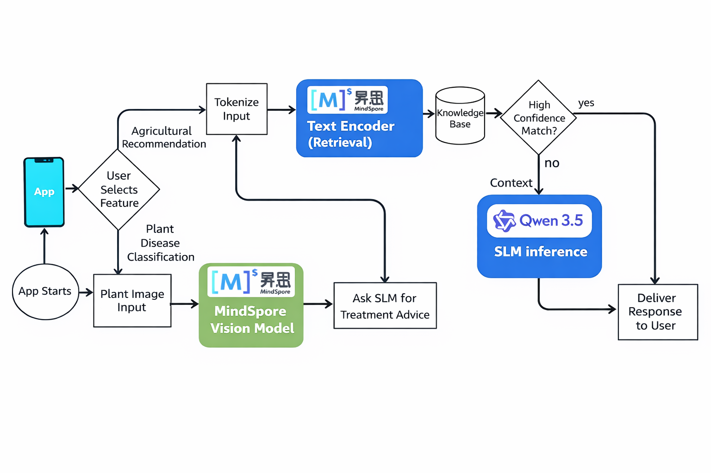

# FarmifAI — Offline AI for Agriculture

**FarmifAI** is an Android app that provides **agricultural recommendations fully offline**, using **Small Language Models (SLMs).**

Built for rural environments, it enables farmers to **diagnose crops and receive recommendations without internet access**.

---

## Key Features

- Offline AI chat (SLM + RAG)  
- Plant disease detection (on-device vision model)  
- Voice interaction (offline STT + TTS)  
- Local inference (no cloud dependency)  
- Privacy-first (all processing on-device)  

---

## Demo

- Final signed APK (direct download):  
   https://github.com/Bryan-Andres-Suarez-Sanchez/FarmifAI/releases/latest/download/FarmifAI-release-v1.0-20260416_193105-signed.apk  
- Download guide + checksum:  
   [docs/APK_DOWNLOAD.md](docs/APK_DOWNLOAD.md)  

---

## Quick Start (under 5 minutes)

1. Download the final signed APK  
   https://github.com/Bryan-Andres-Suarez-Sanchez/FarmifAI/releases/latest/download/FarmifAI-release-v1.0-20260416_193105-signed.apk  

2. Install on Android device  
   adb install -r FarmifAI-release-v1.0-20260416_193105-signed.apk  

3. Open the app and wait for first-time model setup  

4. Test offline  
   - Enable airplane mode  
   - Open the app  
   - Try:

---

## Problem

Agricultural decision-making in rural areas is limited by:

- Lack of localized technical information  
- High environmental variability  
- Limited or unstable internet connectivity  

Cloud-based AI solutions often fail in-field, where they are most needed.

---

## Solution

FarmifAI integrates:

- Local retrieval (RAG)  
- Local generation (GGUF + llama.cpp)  
- On-device vision (MindSpore Lite)  
- Voice interaction  

All running **fully offline on the device**.

---

## Architecture

- UI layer → chat, voice, camera  
- Logic layer → routing and query processing  
- Data layer → local KB + embeddings  
- Inference layer → SLM + vision model  

---

## AI / Model Details

- Hugging Face model: FarmifAI/Qwen3.5-0.8B_FarmifAI2.0
- Runtime: llama.cpp (LLM) + MindSpore Lite (vision & sentence similarity)  
- KB: app/src/main/assets/kb_nueva/extract/*.jsonl  
- Embeddings: (2842, 384) float32  

---

## Limitations

- Not a substitute for professional agronomic advice  
- The model may still produce hallucinations  

---

## Privacy & Permissions

- RECORD_AUDIO → voice input  
- CAMERA → plant diagnosis  
- No internet required for main functionality  

---

## Installation (Developers)

Requirements:
- Android Studio  
- JDK 11  
- Android SDK + NDK  

Build:
- ./gradlew :app:assembleDebug  
- ./gradlew :app:testDebugUnitTest  
- ./scripts/build_apk.sh debug  

---

## Repository Structure

app/ → Android app & inference  
docs/ → Reports & documentation  
tools/ → Vision tools  
scripts/ → Build scripts  

---

## License

Pending  

---

## Acknowledgments
 
- MindSpore Lite  
- llama.cpp  
- Vosk  

AI that works where the internet doesn’t.
